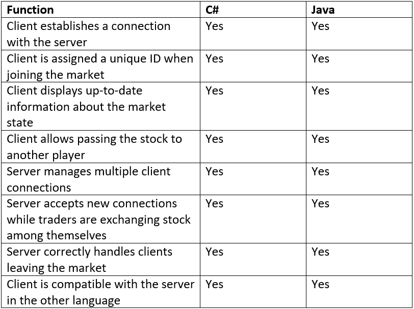

This project includes the assignment required for the coursework aspect of the module, which consists of two versions of a stock market client-server system using sockets.
The **core** requirements for this project are:

The application follows the OOP Paradigm, thus each programming file only contains relevant objects to the class.

The folder 'src' AKA source file contains the application in Java, with each program split into the server side and client side, and the folder 'MarketCS' contains the application in C#, which is also split accordingly.

# Protocol
The Client Program (ClientProgram.cs/.java) acts as the Client User Interface. When ran, a new instance of the Client class (Client.cs/.java) is created and used (calls client constructor) – this constructor method uses Sockets to connect to the server (ServerProgram.cs/.java) and is only successful when the Server is initially running. The ClientProgram calls Client methods (which contain messages to send to the Server) and communicates with the server via the ClientHandler (a thread created by ServerProgram). Each message is sent by a writer (output stream from socket) and read by a reader (input stream from socket).

Once the connection is made, the client is added to a Map (java) or Dictionary (C#) data structure for storage within the constructor, and the client receives a message from the server (sent by ClientHandler) – “online” – as well as the ClientID (each ClientID is unique as it is incremented when a trader is created). The ClientProgram then calls a method in client – isActive() – which writes “ONLINE” to the ClientHandler -this adds the client to an ActiveTraders List. The program then constantly iterates through code (calling methods to transfer and receive messages).

The ClientProgram creates a local copy of the trader ID by calling the getTraderID() method which takes the ClientID (int) as its parameter. This method writes “TRADER ” + ClientID to server and subsequently receives the traderID.

A local copy of the ActiveTraders list is created by calling the getTraders() method in Client – writes to the server “TRADERS” and receives each trader ID within ActiveTraders – this is converted to a local Array within the ClientProgram class. 

When printing the list of traders online to the console - using a for loop to print each online trader line by line - a method getStock() is called, which takes the traderID (int) as its parameter – wites “STOCK” and receives a Boolean indicating if the trader has the stock or not (true/false). If the Boolean value is true, the traderID will also be stated as a Stock owner (printed to console). 

A stock owner is given the option of refreshing the list of online traders to check for any new connections (by simply pressing <Enter Button>) or transferring the stock (by pressing “t”) – any other input will throw an exception (unknown command). Refreshing the list calls the loop to start again, updating the local copies of the trader list and the trader ID, as well as the stock status. If the stock wishes to transfer the stock (to another online trader or to themselves), they must input the trader ID of the trader they wish to transfer to. A method transferStock() is called which takes the trader ID of the user, the trader ID of the trader they wish to transfer, and the Boolean value of the stock (from the user, which is true). This method writes “TRANSFER ” + fromTrader + “ ” + toTrader + “ ” + stock, and receives “success” if the transfer was successful. 
The loop starts again, and the trader to which the stock owner transferred is now the new stock owner (which is shown on the client user interface).
  
# Client Threads
Within the client side, there are no threads created – a new instance of client is used when ClientProgram is run. 
  
# Server Threads
The ServerProgram (java) consists of a main method RunServer() which enables a connection via a specific port number using sockets. When a connection is made, a new Thread (ClientHandler) is created – each client will have a client handler, therefore the server is multi-threaded – number of threads active is equal to the number of clients connected.
  
Synchronised methods are used to prevent errors, specifically when accessing the Map data structure storing the client’s data. 
Each thread (ClientHandler) is alive while there is a connection between that specific client and the server and is killed as soon as the connection is killed/closed (via thrown exceptions, or user closing ClientProgram in any way).
  
Within the c# implementation, the ClientHandler is a method within ServerProgram, which is called when a new client connects.
