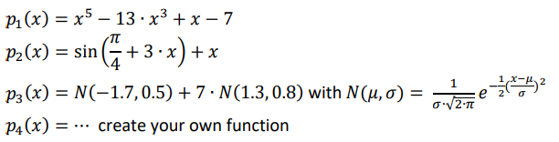

# CE310 Assignment Part 1 – Implementation of the basic functionality for Evolutionary Algorithms

**Assignment Objective**
- The objective of part 1 is to familiarize yourself with evolutionary algorithms, specifically problem solving 
using **genetic algorithms** (GAs).

##  Task 1.2 - Task definition 
*Design and implement the core functions needed for a steady-state binary GA and solve combinatorial 
optimisation problems (see below for more details). Software architecture, design and development 
decisions are entirely up to you. The only requirement is the use of Python (Jupyter/iPython notebook). Select 
and implement crossover, mutation, and selection operators appropriate for the problems to be solved.*

## Task 1.3 - Combinatorial Optimisation Problems
*Solve the following problems:*
1. **Fifty-Fifty:** Test your code by creating individuals that are represented as 120 bit long arrays or 
   bitstrings (chromosome) and evolve individuals using the following fitness function (**pseudocode**):
      
      `fitness(individual) = sum(individual[bit 1 to 60] == 0) + sum(individual[bits 61 to 120] == 1)`
  
   Compute different runs and evolve individuals by firstly maximising and secondly minimising the 
   above fitness function. *What solutions do you expect in both cases?*
  
   To get a better picture about the GA performance, please experiment with the GA hyper-parameters
   such as population size, generations, crossover rate and mutation rate. Also explore hyper-parameters of the 
   selection operator that you decided to use. Start with standard values that we discussed in the lecture.
   *Which parameter combination achieves optimal performance? Why do you think is the parameter combination successful?
   Are there any drawbacks when using the identified parameter combination?*
   
2. **Knapsack Problem:** Design and implement binary representation with appropriate fitness function and solve the 
   Knapsack problem. Please test your implementation with the below configuration. 
   Weight and value of the i-th element are located at the i-th position in the respective array. The 
   maximum weight is 50. Run a few simulations. *Did the GA find the optimal solution? Did you have to 
   adjust the hyper-parameters?*
   
   `weight = [10,4, 7, 4, 5, 5, 5,19,15,10,3,2,18,6,7,4,4,4,4,4,7, 6,7]`
   
   `value = [10,2,30,14,15,16,15,15, 9,10,5,5, 5,5,5,3,3,3,3,3,7,12,5]`
    
3. **Function optimisation:** Explore the impact of different representations and fitness functions (see below) on the 
   performance of your GA. Remember that optimization involves finding the inputs x = (x1, … , xN) to an objective 
   function f(x) that result in the minimum or maximum output of f(x). So, to solve this task you need to define an 
   appropriate representation for x (e.g., binary or real-valued) and then evolve this representation (using the genetic
   operators you developed in the tasks above) to find the global minimum or maximum of f(x).
   
   Use the **Hölder table function** (single-objective optimisation problem) and the Simionescu function (constrained 
   optimisation problem) and implement them as your fitness functions. You find more details about the functions at 
   [https://en.wikipedia.org/wiki/Test_functions_for_optimization](https://en.wikipedia.org/wiki/Test_functions_for_optimization). 
   Run simulations to find the minimum of both functions. *Did the GA find the minimum? How precise is the solution? 
   How can you improve the solution?*
   
4. **Free choice (interesting task for you)**
   You can get even better acquainted with GA by solving additional problems, do more in dept-analysis. For example:
     - **Function optimisation:** You can explore multi-objective fitness functions and/or implement a real-valued GA if you 
       used binary Gas to solve the above problems.
     - **Time to move:** Design and implement the representation and the fitness function that solves 
       the combined N Bin Problem and Knapsack problem that we discussed in the first week.
     - **Come up with your own optimisation problem:** Find or come up with your own combinatorial optimisation problem one 
       and solve it.
     - **Impress me with your creativity and exploratory skills.**

# Part 2 - Mini project
The objective of part 2 is to familiarize yourself with **genetic programming** (GP) by running several experiments (symbolic regression 
problems, see the teaching material on Moodle or [https://en.wikipedia.org/wiki/Symbolic_regression for more details](https://en.wikipedia.org/wiki/Symbolic_regression for more details). While part 1 
focused on the implementation of the basic algorithms to gain insights in the underlying mechanisms of evolutionary computation, part
2 focuses on enhancing your research and analysis skills. More precisely, like a scientist you will collect and analyse empirical data,
summarise, and interpret your results, and based on the evidence gathered draw conclusions.

## Task 2.2 - Task definition
You are asked to perform a series of GP runs and describe the results of your runs in a report. In your experiments you will need to use 
GP in different configurations (i.e., problems and parameters). Since GP is a stochastic searcher, you will see that performance varies
from run to run. Therefore, to draw your conclusions, you should ensure you perform at least 10 runs in each configuration. The aim of 
the experiments is to get an intuition on how the population and tournament size impacts on fitness and size of the evolved programs for
different symbolic regression problems, and on the computational complexity (based on how often the fitness function is being executed). 
Use the following parameter configurations:

- Population size: 500 vs. 2000
- Tournament size: 2 vs. 5
- Set the other parameters of the GP to the following values: generations = 30, crossover rate = 0.7, mutation rate = 0.3.
